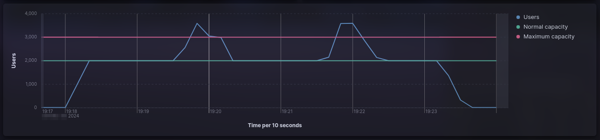
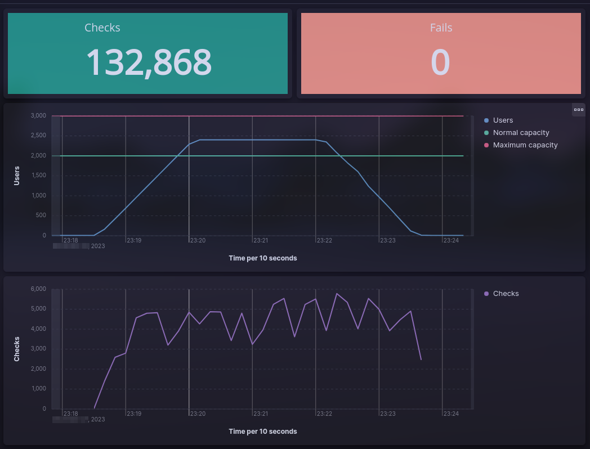

# Performance testing using K6 + Elasticsearch + Kibana + Docker compose


This project is an example of the different types of performance tests that are described in
[Performance testing summary](https://github.com/eccanto/base-performance-testing-documentation) using k6,
Elasticsearch, Kibana and Docker compose.

# Table of contents

* [Overview](#overview)
  * [Scenario: User login with JWT authentication](#scenario-user-login-with-jwt-authentication)
* [Get started](#get-started)
  * [Requirements](#requirements)
  * [Configuration](#configuration)
  * [Run performance testing](#run-performance-testing)
    * [Load testing](#load-testing)
    * [Stress testing](#stress-testing)
    * [Soak testing](#soak-testing)
    * [Spike testing](#spike-testing)
  * [Results](#results)
    * [Kibana dashboard](#kibana-dashboard)
    * [k6 reports](#k6-reports)
        * [summary.html](#summaryhtml)
        * [summary.json](#summaryjson)
        * [summary.txt](#summarytxt)
  * [Clean environment](#crean-environment)
* [License](#license)

# Overview

## Scenario: User login with JWT authentication

The system allows users to log in using JWT for authentication. Upon successful login, the system issues a JWT token
that must be included in subsequent requests to access protected resources.

**Test scenario**

* Simulate concurrent user login attempts.
* Each login attempt includes a valid username and password.
* Upon successful login, the system issues a JWT token.
* The token must be included in subsequent requests for accessing protected resources.

**System parameters**

* **Normal design capacity**: 2000 concurrent users.
* **Maximum design capacity**: 3000 concurrent users.

**Scenario thresholds**

* **HTTP errors**: HTTP errors should be less than 1%.
* **Response time**: 95% of requests should be below 500ms.

# Get Started

## Requirements

- [Docker +24.0.7](https://docs.docker.com/engine/install/ubuntu/)
- [Docker compose +2.21.0](https://docs.docker.com/compose/install/linux/)

## Configuration

Setup environment (start `elasticsearch`, `kibana` and `mockoon`) using docker compose:

```bash
docker compose --profile env up --detach
```

## Run performance testing

### Load testing

**Scenario parameters**

* **Maximum number of users**: 2400 concurrent users, 20% more than the normal design capacity.
* **Ramp-up period**: 1.5 minute, add 400 users every 15 seconds until reaching 2400 concurrent users.
* **Maximum number of users**: 2 minutes, keep the number of users constant at 2400
* **Ramp-down period**: 1.5 minutes, reduce 400 users every 30 seconds until reaching 0 concurrent users.
* **Test duration**: 5 minutes.

#### Run

Run load testing with `10` runners:

1. Change `K6_SCRIPT` variable in `.env` file to `K6_SCRIPT=./tests/load.js`.
2. Start load testing:

  ```bash
  docker compose --profile test up --scale runner=10
  ```

### Result


### Stress testing

**Scenario parameters**

* **maximum number of users**: 3600 concurrent users, 20% more than the maximum designed capacity.
* **initial number of users**: 2 minutes, start with 600 concurrent users and gradually increase.
* **ramp-up period**: 3 minutes, add 500 users every 30 seconds until reaching 3600 concurrent users.
* **test duration**: 5 minutes.

#### Run

Run stress testing with `10` runners:

1. Change `K6_SCRIPT` variable in `.env` file to `K6_SCRIPT=./tests/stress.js`.
2. Start load testing:

  ```bash
  docker compose --profile test up --scale runner=10
  ```

### Result


### Soak testing

**Scenario parameters**

* **number of users**: 2200 concurrent users, 10% more than the normal design capacity.
* **test duration**: 24 hours.

#### Run

Run soak testing with `10` runners:

1. Change `K6_SCRIPT` variable in `.env` file to `K6_SCRIPT=./tests/soak.js`.
2. Start load testing:

  ```bash
  docker compose --profile test up --scale runner=10
  ```

### Result


### Spike testing

**Scenario parameters**

* `test duration`: ~5 minutes.
* `number of spikes`: 2 spikes of 3600 concurrent users, 20% more than the maximum designed capacity.
* `initial number of users`: 1 minute 30 seconds, start with 2000 concurrent users.
* `first spike`: 1 second, add 1600 to reach 3600 concurrent users.
* `intermediate number of users`: 2 minutes, decrease to 2000 concurrent users.
* `second spike`: 1 second, add 1600 to reach 3600 concurrent users.
* `final number of users`: 1 minute 30 seconds, decrease to 2000 concurrent users.

#### Run

Run spike testing with `10` runners:

1. Change `K6_SCRIPT` variable in `.env` file to `K6_SCRIPT=./tests/spike.js`.
2. Start load testing:

  ```bash
  docker compose --profile test up --scale runner=10
  ```

### Result



## Results

### Kibana dashboard

Available in http://localhost:5601/app/dashboards



### k6 reports

Each runner generates a separate reports:

```bash
reports
├── runner-1
│   ├── summary.html
│   ├── summary.json
│   └── summary.txt
├── runner-2
│   ├── summary.html
│   ├── summary.json
│   └── summary.txt
...
├── runner-9
│   ├── summary.html
│   ├── summary.json
│   └── summary.txt
└── runner-10
    ├── summary.html
    ├── summary.json
    └── summary.txt

11 directories, 30 files
```

#### summary.html


#### summary.json


#### summary.txt


## Clean environment

```bash
docker compose --profile env --profile test down
```

# License

[MIT](./LICENSE)
