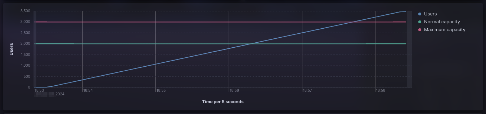

# Performance testing using K6 + Elasticsearch + Kibana


# Table of contents

* [Overview](#overview)
  * [Scenario: User login with JWT authentication](#scenario-user-login-with-jwt-authentication)
* [Get started](#get-started)
  * [Requirements](#requirements)
  * [Configuration](#configuration)
  * [Run performance testing](#run-performance-testing)
    * [Stress testing](#stress-testing)
  * [Results](#results)
    * [Kibana dashboard](#kibana-dashboard)
    * [k6 reports](#k6-reports)
        * [summary.html](#summaryhtml)
        * [summary.json](#summaryjson)
        * [summary.txt](#summarytxt)
  * [Clean environment](#crean-environment)
* [License](#license)

# Overview

## Scenario: User login with JWT authentication

The system allows users to log in using JWT for authentication. Upon successful login, the system issues a JWT token
that must be included in subsequent requests to access protected resources.

**Test scenario**

* Simulate concurrent user login attempts.
* Each login attempt includes a valid username and password.
* Upon successful login, the system issues a JWT token.
* The token must be included in subsequent requests for accessing protected resources.

# Get Started

## Requirements

- [Docker +24.0.7](https://docs.docker.com/engine/install/ubuntu/)
- [Docker compose +2.21.0](https://docs.docker.com/compose/install/linux/)

## Configuration

Setup environment (start `elasticsearch`, `kibana` and `mockoon`):

```bash
docker compose --profile env up --detach
```

## Run performance testing

Global parameters:

**System parameters**

* `normal design capacity`: 2000 concurrent users.
* `maximum design capacity`: 3000 concurrent users.

**Scenario thresholds**

* `HTTP errors`: HTTP errors should be less than 1%.
* `response time`: 95% of requests should be below 500ms.

### Load testing

Load testing assesses an application's performance under typical and peak conditions, aiming to detect performance
bottlenecks prior to the software application's deployment. By subjecting the system to various levels of demand,
load testing helps ensure that the application can handle anticipated loads and identify areas for optimization,
ultimately enhancing the software's reliability and user experience upon going live.

**Scenario parameters**

* `maximum number of users`: 2400 concurrent users, 20% more than the normal design capacity.
* `ramp-up period`: 1.5 minute, add 400 users every 15 seconds until reaching 2400 concurrent users.
* `maximum number of users`: 2 minutes, keep the number of users constant at 2400
* `ramp-down period`: 1.5 minutes, reduce 400 users every 30 seconds until reaching 0 concurrent users.
* `test duration`: 5 minutes.

#### Run

Run stress testing using k6 docker containers (with `10` runners):

1. Change `K6_SCRIPT` variable in `.env` file to `K6_SCRIPT=./tests/load.js`.
2. Start load testing:

  ```bash
  docker compose --profile test up --scale runner=10
  ```


### Stress testing

Stress testing, a type of performance testing, is conducted to assess a system's behavior as the number of users
surpasses the specified requirements, pushing it beyond its intended limits. The primary goal of stress testing is
to determine the threshold at which the application is prone to crashing. Additionally, this test provides valuable
insights into the nature of the application's failure, offering an understanding of how the app crashes and estimating
the time needed for recovery after a crash occurs. Notably, stress testing is executed beyond the confines of normal
working conditions, enabling a comprehensive evaluation of the system's robustness and its ability to handle extreme
scenarios.

**Scenario parameters**

* `maximum number of users`: 3600 concurrent users, 20% more than the maximum designed capacity.
* `initial number of users`: start with 600 concurrent users and gradually increase.
* `ramp-up period`: 2 minutes, add 500 users every 30 seconds until reaching 3000 concurrent users.
* `test duration`: 5 minutes.

#### Run

Run stress testing using k6 docker containers (with `10` runners):

1. Change `K6_SCRIPT` variable in `.env` file to `K6_SCRIPT=./tests/stress.js`.
2. Start load testing:

  ```bash
  docker compose --profile test up --scale runner=10
  ```



### Soak testing

Soak testing, also referred to as Endurance Testing, involves assessing software performance under a sustained normal
workload for an extended period. The primary goal of Soak testing is to uncover potential system issues, such as
memory leaks, that may emerge during prolonged usage. This testing methodology helps ensure the software's stability
and reliability over time, allowing for the identification and resolution of any issues related to extended operation.

**Scenario parameters**

* `number of users`: 2200 concurrent users, 10% more than the normal design capacity.
* `test duration`: 24 hours.

#### Run

Run stress testing using k6 docker containers (with `10` runners):

1. Change `K6_SCRIPT` variable in `.env` file to `K6_SCRIPT=./tests/soak.js`.
2. Start load testing:

  ```bash
  docker compose --profile test up --scale runner=10
  ```


### Spike testing

Spike testing is a subset of performance testing, involves rapidly altering the load on a system by introducing a
substantial increase or decrease in the number of users. The primary aim is to assess how the system responds to
abrupt changes, determining whether performance degradation, system failure, or successful handling of dramatic load
variations occurs. This type of testing helps uncover how resilient the system is under sudden spikes in user
activity, contributing valuable insights into its stability and capacity to manage unforeseen fluctuations.

**Scenario parameters**

* `test duration`: ~5 minutes.
* `number of spikes`: 2 spikes of 3600 concurrent users, 20% more than the maximum designed capacity.
* `initial number of users`: start with 2000 concurrent users during 1 minute 30 seconds.
* `first spike`: add 1600 to reach 3600 concurrent users in 1 seconds.
* `intermediate number of users`: decrease to 2000 concurrent users during 2 minutes.
* `second spike`: add 1600 to reach 3600 concurrent users in 1 seconds.
* `final number of users`: decrease to 2000 concurrent users during 1 minute 30 seconds.

#### Run

Run stress testing using k6 docker containers (with `10` runners):

1. Change `K6_SCRIPT` variable in `.env` file to `K6_SCRIPT=./tests/spike.js`.
2. Start load testing:

  ```bash
  docker compose --profile test up --scale runner=10
  ```


## Results

### Kibana dashboard

Available in http://localhost:5601/app/dashboards


### k6 reports

Each runner generates a separate reports:

```bash
reports
├── runner-1
│   ├── summary.html
│   ├── summary.json
│   └── summary.txt
├── runner-2
│   ├── summary.html
│   ├── summary.json
│   └── summary.txt
...
├── runner-9
│   ├── summary.html
│   ├── summary.json
│   └── summary.txt
└── runner-10
    ├── summary.html
    ├── summary.json
    └── summary.txt

11 directories, 30 files
```

#### summary.html


#### summary.json


#### summary.txt


## Clean environment

```bash
docker compose --profile env --profile test down
```

# License

[MIT](./LICENSE)
