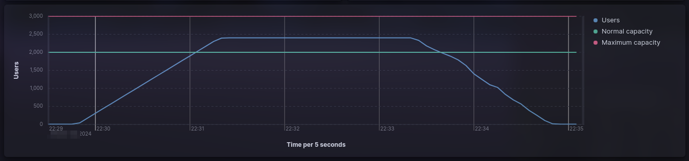

# Performance testing using K6 + Elasticsearch + Kibana + Docker compose


This project is an example of the different types of performance tests that are described in
[Performance testing summary](https://github.com/eccanto/base-performance-testing-documentation) using k6,
Elasticsearch, Kibana and Docker compose.

# Table of contents

* [Get started](#get-started)
  * [Requirements](#requirements)
  * [Configuration](#configuration)
  * [Run performance testing](#run-performance-testing)
    * [Implementation of "Case 1: Load testing"](#implementation-of-case-1-load-testing)
    * [Implementation of "Case 2: Stress testing"](#implementation-of-case-2-stress-testing)
    * [Implementation of "Case 3: Soak testing"](#implementation-of-case-3-soak-testing)
    * [Implementation of "Case 4: Spike testing"](#implementation-of-case-4-spike-testing)
  * [Results](#results)
    * [Kibana dashboard](#kibana-dashboard)
    * [k6 reports](#k6-reports)
        * [summary.html](#summaryhtml)
        * [summary.json](#summaryjson)
        * [summary.txt](#summarytxt)
  * [Clean environment](#crean-environment)
* [License](#license)

# Get Started

## Requirements

- [Docker +24.0.7](https://docs.docker.com/engine/install/ubuntu/)
- [Docker compose +2.21.0](https://docs.docker.com/compose/install/linux/)

## Configuration

Setup environment (start `elasticsearch`, `kibana` and `mockoon`) using docker compose:

```bash
docker compose --profile env up --detach
```

## Run performance testing

### Implementation of "Case 1: Load testing"

#### Run

Set `K6_SCRIPT=tests/load.js` in `.env` file:

```bash
sed -i 's/\(K6_SCRIPT=\).\+/\1tests\/load.js/' .env
```

Run load testing with `10` runners:

```bash
docker compose --profile test up --scale runner=10
```

#### Result



### Implementation of "Case 2: Stress testing"

#### Run

Set `K6_SCRIPT=tests/stress.js` in `.env` file:

```bash
sed -i 's/\(K6_SCRIPT=\).\+/\1tests\/stress.js/' .env
```

Run stress testing with `10` runners:

```bash
docker compose --profile test up --scale runner=10
```

#### Result


### Implementation of "Case 3: Soak testing"

#### Run

Set `K6_SCRIPT=tests/soak.js` in `.env` file:

```bash
sed -i 's/\(K6_SCRIPT=\).\+/\1tests\/soak.js/' .env
```

Run soak testing with `10` runners:

```bash
docker compose --profile test up --scale runner=10
```

#### Result


### Implementation of "Case 4: Spike testing"

#### Run

Set `K6_SCRIPT=tests/spike.js` in `.env` file:

```bash
sed -i 's/\(K6_SCRIPT=\).\+/\1tests\/spike.js/' .env
```

Run spike testing with `10` runners:

```bash
docker compose --profile test up --scale runner=10
```

#### Result


## Results

### Kibana dashboard

Available in http://localhost:5601/app/dashboards


### k6 reports

Each runner generates a separate reports:

```bash
reports
├── runner-1
│   ├── summary.html
│   ├── summary.json
│   └── summary.txt
├── runner-2
│   ├── summary.html
│   ├── summary.json
│   └── summary.txt
...
├── runner-9
│   ├── summary.html
│   ├── summary.json
│   └── summary.txt
└── runner-10
    ├── summary.html
    ├── summary.json
    └── summary.txt

11 directories, 30 files
```

#### summary.html


#### summary.json


#### summary.txt


## Clean environment

```bash
docker compose --profile env --profile test down
```

# License

[MIT](./LICENSE)
